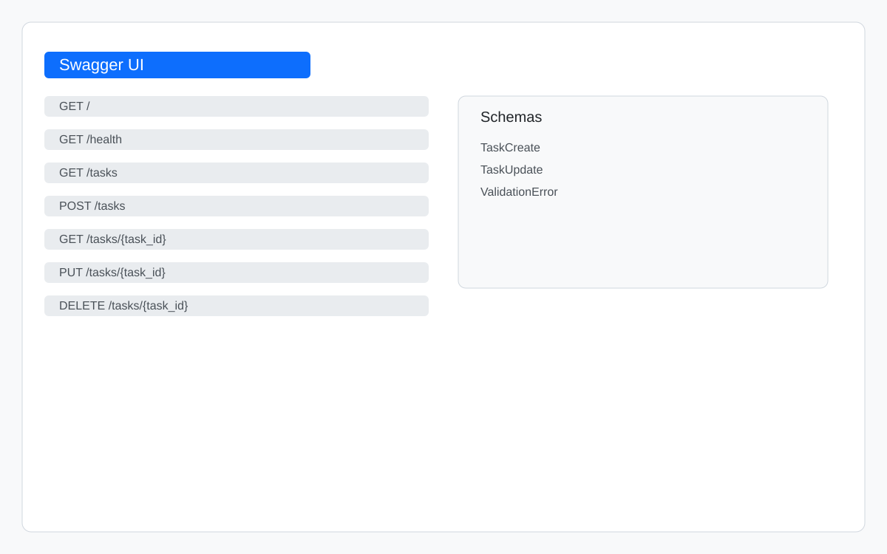

# First CRUD API

This project is a small FastAPI application for managing tasks. It supports basic CRUD operations with an in-memory task list and includes a health check endpoint plus Swagger UI for interactive testing.

## Install and run

From the project root, run this single command:

```bash
pip install -r requirements.txt && uvicorn main:app --reload
```

The API will be available at http://127.0.0.1:8000/docs.

## Endpoints

| Method | Path | Description |
| --- | --- | --- |
| GET | / | Returns the API name, version, and available endpoint list |
| GET | /health | Health check endpoint |
| GET | /tasks | List all tasks |
| GET | /tasks/{task_id} | Get one task by ID |
| POST | /tasks | Create a new task |
| PUT | /tasks/{task_id} | Update an existing task |
| DELETE | /tasks/{task_id} | Delete a task |

## Example request

```bash
curl -i http://127.0.0.1:8000/health
```

```http
HTTP/1.1 200 OK
date: Tue, 14 Jul 2026 18:56:36 GMT
server: uvicorn
content-length: 15
content-type: application/json

{"status":"ok"}
```

## Swagger screenshot


