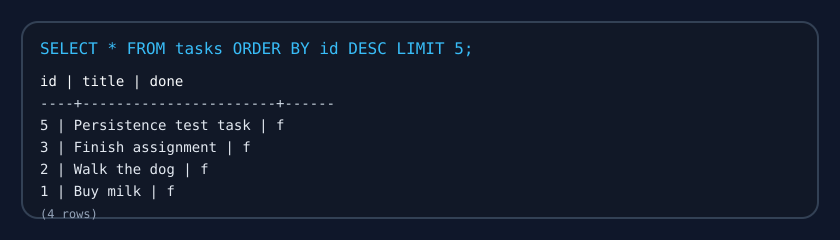

# First CRUD API

A FastAPI task API backed by PostgreSQL running in Docker. The app provides full CRUD for tasks, a health check, and live Swagger UI documentation.

## Install and run

**Requirements:** Docker Desktop (or a compatible container runtime).

1. Copy the example environment file:
```bash
cp .env.example .env
```
2. Start the full stack:
```bash
docker compose up
```
3. Open the API docs at `http://localhost:8000/docs`.

The database starts in Docker, the tasks table is created automatically, and the app is ready for requests.

## Endpoints

| Method | Path | Description | Success | Errors |
| --- | --- | --- | --- | --- |
| GET | / | API info | 200 | — |
| GET | /health | Health check | 200 | — |
| GET | /tasks | List all tasks | 200 | — |
| GET | /tasks/{task_id} | Get a task by ID | 200 | 404 |
| POST | /tasks | Create a new task | 201 | 400 |
| PUT | /tasks/{task_id} | Update a task | 200 | 400, 404 |
| DELETE | /tasks/{task_id} | Delete a task | 204 | 404 |

## Example request

```bash
curl -i http://localhost:8000/tasks
```

```http
HTTP/1.1 200 OK
date: Mon, 10 Aug 2026 06:52:37 GMT
server: uvicorn
content-length: 191
content-type: application/json

[{"id":1,"title":"Buy milk","done":false},{"id":2,"title":"Walk the dog","done":false},{"id":3,"title":"Finish assignment","done":false},{"id":5,"title":"Persistence test task","done":false}]
```

## Database

- **Why PostgreSQL in Docker:** Postgres is a production-grade relational database, unlike SQLite or in-memory storage. Running it in Docker avoids manual installation, keeps the environment consistent, and lets the app use a real database service.
- **Connection string:** the app reads `DATABASE_URL` from `.env` or from the container environment. `.env` is gitignored, and `.env.example` shows the required key.
- **Why the `db` service name matters:** inside Docker Compose, the API container connects to the database using the service name `db`, not `localhost`. `localhost` would point to the app container itself, so `db` is the correct host inside the Docker network.

## Database screenshot



## Example SQL query

```sql
SELECT * FROM tasks ORDER BY id DESC LIMIT 5;
```

Result:

```
 id |         title         | done 
----+-----------------------+------
  5 | Persistence test task | f
  3 | Finish assignment     | f
  2 | Walk the dog          | f
  1 | Buy milk              | f
(4 rows)
```

## Persistence proof

Created a task, brought the stack down with `docker compose down`, then started it again with `docker compose up`. The task still existed in Postgres after the restart, proving persistent storage.
